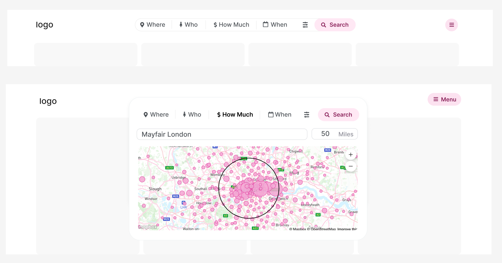
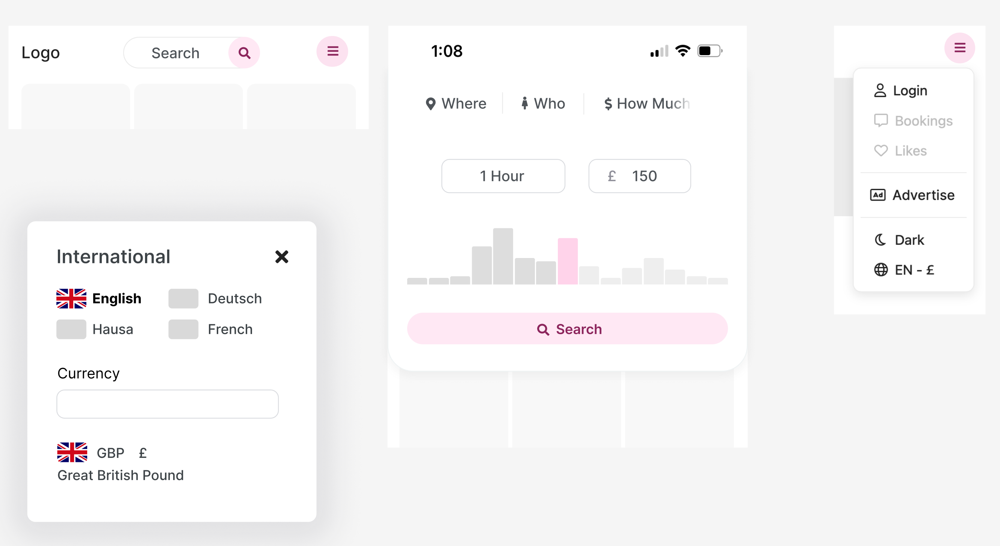
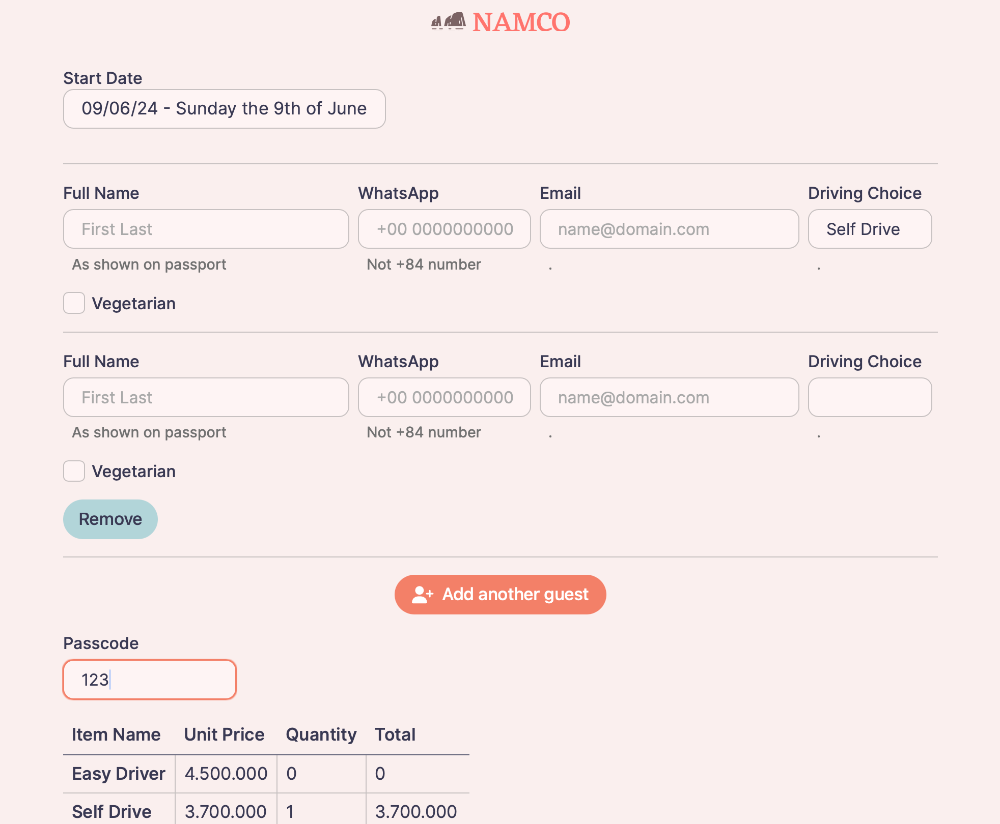

# James SvelteKit Portfolio

_Please understand these are personal projects that were not originally intended for use as
portfolio pieces. I have removed some code so don't expect them to run._

- Sveltekit
- SurrealDB
- Typescript
- Vercel

# Au Pair Advertising

Here is a 58 second [video](https://youtu.be/1QV7ZCiWJL8) demo 
to get an idea of the code your looking at. You can watch it at 2x speed.

- Almost classless custom CSS framework
- Endpoints
- Optional Prerendering
- Sitemap generation
- Skeleton loading
- Dark/Light Theme
- Pocketbase
- Square
- Localisation

# Travel Company

Travel agents make and pay for tour reservations using a domestic Vietnamese banking system. Guests are then sent information via Whatsapp and email. Vendors like hotels are given a summary of tours as well as detailed purchase orders and a list of guests.

- Playwright Integration Testing

